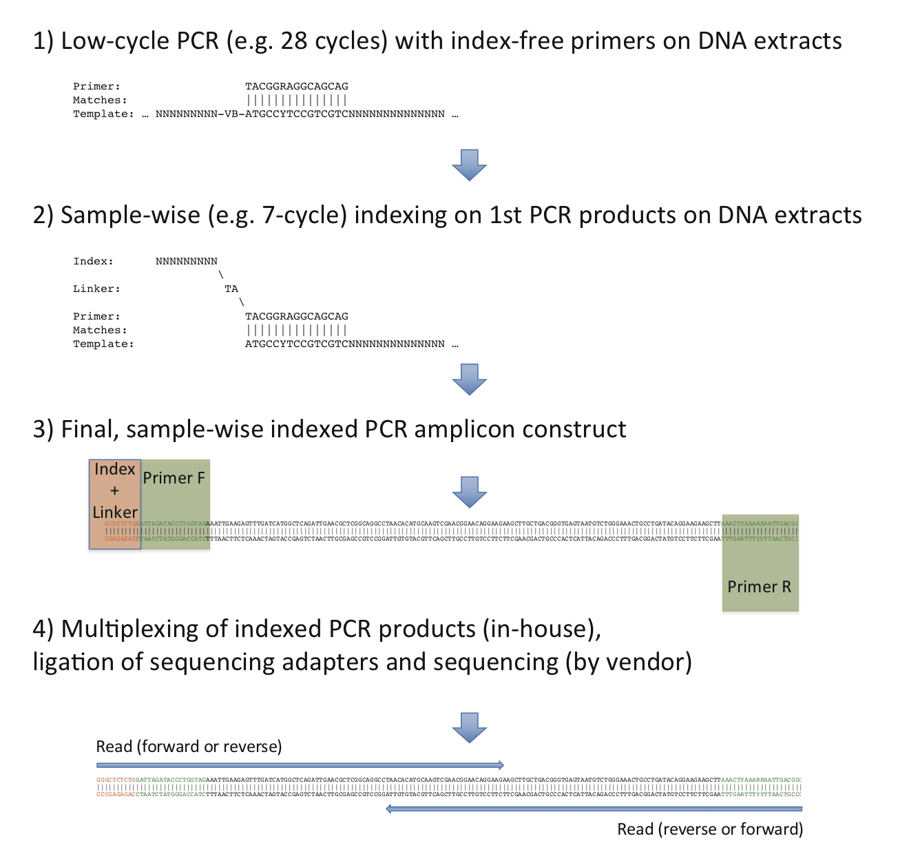

# ***Nutritional inter-dependencies and a carbazole-dioxygenase are key elements of a bacterial consortium relying on a Sphingomonas for the degradation of the fungicide thiabendazole***
### By Sotirios Vasileiadis <sup>a</sup>, Chiara Perruchon <sup>a</sup>, Poulopoulou Maria-Sofia <sup>a</sup>, Benjamin Scheer <sup>b</sup>, Lorenz Adrian <sup>b,d</sup>, Nicole Steinbach <sup>c</sup>, Marco Trevisan <sup>e</sup>, Patricia Plaza-Bolaños <sup>f</sup>, Ana Agüera <sup>f</sup>, Antonis Chatzinotas <sup>c</sup>, Dimitrios G Karpouzas *<sup>a</sup>

### (\* corr. author)


<sup>a</sup> Department of Biochemistry and Biotechnology, Laboratory of Plant and Environmental Biotechnology, University of Thessaly, Larissa, Viopolis 41500, Greece

<sup>b</sup> Department of Isotope Biogeochemistry and c Department of Environmental Microbiology, Helmholtz Centre for Environmental Research – UFZ, Leipzig, Germany

<sup>d</sup> Chair of Geobiotechnology, Technische Universität Berlin, Germany

<sup>e</sup> Department of Sustainable Food Process, Universitá Cattolica del Sacro Cuore, Piacenza, Italy

<sup>f</sup> Solar Energy Research Centre (CIESOL), Joint Center University of Almería-CIEMAT, Almeria, Spain


## Detailed Materials and Methods

The present material includes all the wet-lab and computational methods of our study.

For obtaining all necessary material the users need to open a terminal, git-clone or download the repository, and enter the base folder. E.g:

```
$ git clone https://github.com/SotiriosVasileiadis/mconsort_tbz_degr.git
```

In the case of the computational methods, with the "mconsort_tbz_degr" folder as working directory, and assumming that the necessary software and R packages (described in the following sections) are installed, all code can be executed as described in this Readme.md file. The datasets necessary for performing all sequencing based analysis can be downloaded from the sources mentioned in the [Availability of data](#availability) section listed below. Also, some of the result files with suitable sizes are provided for reviewing purposes without having to clone and run the complete code; for keeping the file sizes low we had to compress some files and folders which might need expansion before use.

### Table of contents<a name="toc"></a>

[TBZ degradation assays](#assays)

[Media and culture conditions](#media)

[TBZ concentration measurement](#tbz)

[Nucleic acids extraction and 16S rRNA gene quantification](#nucleic)

[Density gradient centrifugation and fractionation of labelled and non-labelled DNA](#density)

[16S rRNA gene diversity analysis](#16s)

[Metagenome assembly, contig binning to genomes, annotation and synteny analysis](#metagenome)

[RNA sequencing and data analysis](#rna)

[Shotgun protein analysis](#protein)

[TBZ transformation product analysis and prediction](#metabolites)

[Carbazole/TBZ structural comparisons and in silico prediction of carbazole dioxygenase-TBZ interactions](#docking)

[Availability of data](#availability)

[References](#references)

[Code Usage disclaimer](#disclaimer)


**TBZ degradation assays.<a name="assays"></a>** [↑](#toc)

***Experiment 1 - SIP analysis:*** A first degradation assay was performed to identify the members of the consortium involved in the transformation of TBZ via DNA-SIP based amplicon sequencing analysis. Triplicate 30-ml cultures of the consortium were supplemented with 25 mg l<sup>-1</sup> of unlabelled (<sup>12</sup>C) or <sup>13</sup>C-TBZ labelled uniformly in its phenyl moiety (Clearsynth<sup>®</sup>, Mumbai, India). Triplicate flasks of MSMN supplemented with unlabeled TBZ but not inoculated with the consortium were co-incubated as abiotic controls. Aliquots of the cultures (0.5 ml) were removed at 36, 72, 117 and 141 h, (corresponding to 10%, 30%, 100% degradation of TBZ and 24 h after its complete degradation) to determine: (i) TBZ degradation via HPLC analysis and (ii) community composition via DNA extraction and amplicon sequencing.

***Experiment 2 - multi-omic analyses:*** A second degradation assay was employed to disentangle metabolic interactions between consortium members and to identify, via a multi-omic approach, the key genes/enzymes driving the transformation of TBZ. Triplicate cultures of the consortium were amended either with 25 mg l<sup>-1</sup> TBZ (125 µM) or 37 mg l<sup>-1</sup> of succinate (SUC; 314 µM) as the sole carbon source (with a carbon concentration of 15 µg ml<sup>-1</sup> in each case). Parallel triplicate abiotic controls as described above were also included. Aliquots (0.5 to 4 ml depending on the type of measurement employed) were removed from cultures at multiple time points along the degradation of TBZ and used for DNA/RNA/protein extraction and downstream metagenome binning, transcriptomic, proteomic and non-target MS analysis for TBZ transformation product detection.

***Experiment 3 – cobalamin effect:*** A TBZ degradation assay with varying levels of cobalamin supplementation was also performed for assessing cobalamin related interactions between microbial consortium members. Filter sterilized cobalamin aquatic solution was added in MSMN+TBZ media at final concentrations of 0 (control), 0.01, 1 and 100 ng ml<sup>-1</sup> (or 0, 0.0073, 0.73 and 73 nM respectively). Naturally occurring concentrations found in aquatic environments and soil solutions [1, 2] were considered for the final concentration choices. 16S rRNA gene diversity analysis was performed next to the TBZ dissipation analysis for assessing interactions between the consortium community members and DT<sub>50</sub>s respectively.


**Media and culture conditions.<a name="media"></a>** [↑](#toc) A minimal salts medium (MSMN) was used for the routine cultivation of the bacterial consortium. The MSMN consisted of (g l<sup>-1</sup>): KH<sub>2</sub>PO<sub>4</sub>, (2.27), Na<sub>2</sub>HPO<sub>4</sub>.12H<sub>2</sub>O (5.97), NH<sub>4</sub>Cl (1.0), MgSO<sub>4</sub>.7H<sub>2</sub>O, (0.5) CaCl<sub>2</sub>.2H<sub>2</sub>O, (0.01), MnSO<sub>4</sub>.4H<sub>2</sub>O (0.02) and FeSO<sub>4</sub>, (0.025), with an overall pH of 6.8 All reagents for the MSMN were purchased from Sigma-Aldrich St. (Louis, USA). All solutions were autoclaved except for the iron-containing stock solution which was filter sterilized (0.22 µm, Q-max, Frisenette, Knebel, Denmark), and were aseptically added to the final medium. In all assays the inoculum was derived from fresh liquid cultures which had been amended with 25 µg ml<sup>-1</sup> TBZ (Sigma-Aldrich, St. Louis, Missouri, USA) as sole carbon source and was harvested when TBZ degradation was nearly complete, a point coinciding with maximum bacterial growth of the consortium as determined by preliminary q-PCR tests. TBZ was added to the medium to a final concentration of 25 µg ml<sup>-1</sup> (or 125 µM) from a filter-sterilized 125 mM DMSO stock solution. The final DMSO concentration in the medium was < 0.1 % with the same DMSO content being added in the TBZ free treatments. Filter sterilized succinate was added in equal carbon mass concentration (15 µg ml<sup>-1</sup> in each case) with the TBZ (37 µg ml<sup>-1</sup> final concentration; 314 µM). The TBZ used in the stable isotope experiments was uniformly <sup>13</sup>C-labeled at its phenolic ring (purchased from Clearsynth<sup>®</sup>, Mumbai, India). For testing the cobalamin effects on the microbial community, filter sterilized cobalamin aquatic solution was added in MSMN+TBZ media at final concentrations of 0.01, 1 and 100 ng ml-1 (or 0.0073, 0.73 and 73 nM respectively).

**TBZ concentration measurement.<a name="tbz"></a>** [↑](#toc) The concentration of TBZ in the growth medium during the degradation assays was monitored in aliquots of 0.5 ml which were regularly removed from the bacterial culture. TBZ residues were extracted by mixing the 0.5 ml of the aqueous medium with 1 ml methanol. The mixture was vortexed for 30 sec, centrifuged for 1 min at 17,000 g and the clear supernatant was analyzed in a LabAlliance HPLC system equipped with a Marathon III pump (Rigas Labs, Thessaloniki, Greece) and a FASMA model 500 UV-Vis detector (Rigas Labs, Thessaloniki, Greece). The fungicide was eluted through a RP-C18 column (Athens, RP-C18, 120 Å, 4.6 mm x 150 mm, 5 µm) and it was detected at 254 nm using a mobile phase of 39% acetonitrile (ACN), 60.5% H2O and 0.5% NH3. The concentration of TBZ was determined via external calibration curve prepared by injection of standard solutions of TBZ in methanol with concentrations ranging from 0.1 (limit of quantification) to 10 µg ml<sup>-1</sup>. TBZ kinetics were modeled using the mkin v1.0.3 [3] package of the R v3.6.3 software [4].


**Nucleic acids extraction and 16S rRNA gene quantification.<a name="nucleic"></a>** [↑](#toc) DNA and RNA extractions were performed on bacterial cell pellets with the NucleoSpin<sup>®</sup> Tissue and RNA kits respectively (Macherey-Nagel & Co, Düren, Germany) according to the manufacturer’s instructions. The nucleic acid extracts were quantified with the Quant-iT™ HS ds-DNA assay kit and the Quanti-iT™ RNA HS kit with a Qubit™ fluorometer (Invitrogen, USA). 

**Density gradient centrifugation and fractionation of labelled and non-labelled DNA.<a name="density"></a>** [↑](#toc) DNA was extracted from bacterial cultures fed on <sup>13</sup>C-labeled-TBZ and on unlabeled TBZ and quantified as described above. The DNA was separated into <sup>13</sup>C-labeled and unlabeled (<sup>12</sup>C) according to its molecular mass as described previously [5, 6]. Briefly, a calibration curve was generated with a density gradient generated by mixing a CsCl (≥99.999 % p.a., Carl Roth, Karlsruhe, Germany) solution (250 g of CsCl with 250 mL of sterile ddH2O water) with a gradient buffer (GBf - 50 ml of 1 M Tris-HCl, 3.75 g KCl and 1 ml of 0.5 M EDTA to 400 ml of water) at volume ratios starting from 100%/0% (CsCl/GBf) to 75%/25% (CsCl/GBf) by 5% volume increments. Each CsCl/GBf gradient was measured for its density by weight and its refraction index with an AR200 Handheld Digital refractometer (Reichert, Seefeld, Germany). The calculated calibration curve was used for setting the targeted initial CsCl density at 1.72 g ml<sup>-1</sup> for the DNA suspensions (using CsCl solution or GBf) prior ultracentrifugation, based on the refractive index values (1.4033 at 22 ˚C). The density adjusted DNA suspensions were transferred into 5.2 ml QuickSeal Polyallomer tubes (Beckman Coulter Pasadena, USA) of approximately equal weights, they were then heat sealed and centrifuged at 167k g (44,100 rpm), 20 ˚C, in vacuum for 36 hours in an Optima XPN-80 Ultracentrifuge (Beckman Coulter – maximum acceleration and minimum deceleration settings were employed) with the NVT 65.2 rotor (Beckman Coulter). The centrifuge tubes were carefully retrieved and secured at a stable position avoiding disturbing the generated CsCl gradient. The tubes were pierced near the top and right underneath the CsCl gradient surface with a syringe connected with a peristaltic pump through a tube supplied with constant sterile water flow. After, the tubes were pierced at the bottom and the pump was set to 1 ml min<sup>-1</sup> and activated, allowing the dripping of the tube content in a gradient-based order from the ultracentrifuge tube bottoms into 1.5 ml Eppendorf (Hamburg, Germany) tubes which were exchanged with empty ones (corresponding to the different density gradient fractions) every 25 seconds (0.5 ml of CsCl gradient fractions per tube retrieved). The arrangement resulted in a constant transfer of the gradient in the 1.5 ml tubes and a stable liquid volume in the ultracentrifuge tubes. The refractive indexes of each collected CsCl-DNA suspension were measured and the subsample densities were calculated using the previously generated calibration curve. The DNA was purified from salts via glycogen/polyethylene glycol (PEG) precipitation as follows: One µl of glycogen and 2 volumes of PEG were added to the DNA suspensions. The tubes were mixed thoroughly, incubated at 4˚C for 15 hours and centrifuged at 13,000 g for 30 minutes at 15 ˚C. The supernatant was discarded and the pellet was washed with 500 µl of 70 % EtOH. After centrifugation for 10 minutes at 13,000 g and 15 ˚C, the supernatant was discarded, followed by drying in a desiccator at room temperature and in vacuum. The resulting pure DNA pellet was suspended in 30 µl of Tris-EDTA pH 8.0 and quantified as described above. 

**16S rRNA gene diversity analysis.<a name="16s"></a>** [↑](#toc) DNA extracts were used for performing the 16S rRNA gene diversity analysis via PCR, during which the PCR products of all samples were indexed via a designed 5’ extension of the forward primer, multiplexed in a single pool according to a previously setup protocol [7-9] and sequenced at Illumina instruments. 


**Figure** ***Overview of the implemented multiplex amplicon sequencing protocol.***

Briefly, the PCR reactions were performed into two steps as suggested by Berry et al [10] for avoiding primer index induced biases. In the first step 10 µl-PCR reactions  were prepared using 2 µl of template DNA (normalized at 0.1 ng µl<sup>-1</sup>), 0.4 µM of each primer (515f 5’-GTGYCAGCMGCCGCGGTAA-3’, 806r 5’-GTGYCAGCMGCCGCGGTAA-3’),5 µl of the Q5<sup>®</sup> High Fidelity 2X master-mix (New England Biolabs<sup>®</sup>, Ipswich, MA, USA), 0.2 µl of molecular biology grade bovine serum albumin (BSA, New England Biolabs<sup>®</sup>, Ipswich, MA, USA), and volume was made up to 10 μl with PCR grade H2O. The thermal cycling conditions were as follows: 3 minutes at 94 ˚C for enzyme activation, followed by 28 cycles of 30 seconds at 94 ˚C for denaturation, 30 seconds at 50 ˚C for annealing, and 30 seconds at 72 ˚C for extension, and with the cycles followed by 10 minutes at 72 ˚C of final extension. The second step PCR was performed in 20 µl reactions composed of 2 µl of the first step PCR product as template, 10 µl of the Q5<sup>®</sup> High Fidelity 2X master-mix, 0.4 µM of each primer (the reversed primer was the 806r while the forward was the 515f  including the 5’ linker index extension – complete list is provided in Table S2), and the rest was filled with PCR grade water. The thermal cycling conditions of the second step PCR were the same with those of the first step PCR with the sole difference that only 7 cycles (instead of 28) were performed. The second step PCR product concentrations were determined with the QubitTM HS dsDNA assay kit (Invitrogen, Carlsbad, CA, USA) and equimolar amounts of each indexed product were multiplexed and purified with the Agencourt AMPureXP PCR purification kit (Beckman Coulter, Brea, CA, USA) prior to sequencing. The indexed primers were designed and selected according to their secondary formation with the barcrawl v100310 software [11]. 

Sequencing was performed at the Genome sequencing center of the Brigham Young University (Provo, UT, USA) at a HiSeq2500 instrument at Rapid Mode generating 250 bp paired-end reads for the TBZ vs succinate and the <sup>13</sup>C vs <sup>12</sup>C TBZ supplementation experiments, and also at the Greek Genome Center of the Biomedical Research Foundation Academy of Athens (BRFAA, Athens, Greece) at a MiSeq instrument using the v3 chemistry for producing 2x300bp reads of the amplicons of the cobalamin effect assessment experiment. The resulting sequences were demultiplexed according to their samples of origin (no index/primer mismatch allowed) with Flexbar v3.5.0 [12]. Amplicon sequence variant (ASV) reconstruction (equivalent to genotype), quality control (ASV abundance-based removal of chimeras), abundance and relative abundance matrices of ASVs, sequence taxonomy annotations and phylogenies were produced with the dada2 v1.4.1 [13] R package according to previously published protocols [14] amended to support our indexing approach (removal of the 11 bp preceding the forward primer), and using SILVA v138 database [15] as reference. Other R packages were used in the data prep and analysis as follows: Phyloseq v1.30.0 [16] was used for various dataset operations; Phangorn v2.5.5 [17] was used for phylogenetic inferences; Biostrings v2.54.0 and [18] was used for sequence processing; vegan v2.5.7 [19] was used for the performed permutational multivariate analysis of variance (PERMANOVA), the performed matrix transformations and distance calculations, the multivariate approaches; metacoder v0.3.4.9002 [20] was used for the graphical representation of the differential abundance trees; entropart v1.6.6 [21] was used for calculating α diversity indices and estimators; the mkin R package (described in the “TBZ concentration measurement” section) was used for performing the TBZ kinetics analysis. 

*Coding corner: The code described here and provided in this repository was used for performing the amplicon sequencing data analysis. All necessary files (SRR accession numbers and barcode files, bash and R code) are provided in the "4_microbiomes" subfolders and the order of execution is described in this section below* 

*Software prerequisites and versions used:*

- [Edirect tools v14.2](https://dataguide.nlm.nih.gov/edirect/install.html)

- [Flexbar v3.5.0](https://github.com/seqan/flexbar)

- [R v3.6.3](https://www.r-project.org)

- [SRA toolkit v2.10.9](https://github.com/ncbi/sra-tools/wiki/02.-Installing-SRA-Toolkit)

- Our own multiplexing method-specific demultiplexing script developed by Sotirios Vasileiadis [DemuxOwnBCsys_absPATH.sh](2_demultiplex_data/prok/DemuxOwnBCsys_absPATH.sh) (provided in the supplied material) using flexbar and a series of bash, AWK, and perl oneliners for preparing the demultiplexed files.

*R packages used:*

- [ade v1.7.16](https://cran.r-project.org/web/packages/ade4/)

- [agricolae v1.3.3](https://cran.r-project.org/web/packages/agricolae/)

- [Biostrings v2.54.0](https://bioconductor.org/packages/release/bioc/html/Biostrings.html)

- [dada2 v1.4.1](http://benjjneb.github.io/dada2/)

- [entropart v1.6.6](https://cran.r-project.org/web/packages/entropart/)

- [gtools v3.8.2](https://cran.r-project.org/web/packages/gtools/)

- [Hmisc v4.5.0](https://cran.r-project.org/web/packages/Hmisc/)

- [metacoder v0.3.4.9002](https://grunwaldlab.github.io/metacoder_documentation/)

- [mkin v1.0.3](https://cran.r-project.org/web/packages/mkin/)

- [PerformanceAnalytics v2.0.4](https://cran.r-project.org/web/packages/PerformanceAnalytics/)

- [phangorn v2.5.5](https://cran.r-project.org/web/packages/phangorn/)

- [pheatmap v1.0.12](https://cran.r-project.org/web/packages/pheatmap/)

- [phyloseq v1.30.0](https://bioconductor.org/packages/release/bioc/html/phyloseq.html)

- [plyr v1.8.6](https://cran.r-project.org/web/packages/plyr/)

- [RColorBrewer v1.1.2](https://cran.r-project.org/web/packages/RColorBrewer/)

- [reshape2 v1.4.4](https://cran.r-project.org/web/packages/reshape2/)

- [stringr v1.4.0](https://cran.r-project.org/web/packages/stringr/index.html)

- [TeachingDemos v2.12](https://cran.r-project.org/web/packages/TeachingDemos/)

- [vegan v2.5.7](https://cran.r-project.org/web/packages/vegan/)

*Execution order*

*1) execute the [fetch_and_demultiplex_microbiomes.sh](4_microbiomes/fetch_and_demultiplex_microbiomes.sh)* 

This bash executable downloads the sequences corresponding to each sample from the National Center for Biotechnology information (NCBI) sequence read archive (SRA) in the 1_fetch_and_demultiplex/library_name/1_raw_sequences (library_name is one of the 4 originally generated libraries, two for the tbz *vs* succinate and the SIP experiments and two for the cobalamin supplementation experiment), and splits them into forward and reverse according to the read direction generated by the sequencing instrument. This direction, given our multiplexing approach prior sequencing (Figure), does not guarantee the sample index being either in the forward or the reverse read, rather its occurrence in any of the reads is random. For this purpose, the sequence reads originally derived from each library, are concatenated (re-multiplexed) and demultiplexed *de novo*, and are re-oriented in such manner that they always retain the index and the indexed primer in the R1 reads collection and the reverse primer in the R2 collection (the output files end up in the 1_fetch_and_demultiplex/library_name/2_demultiplexed_sequences, library name is explained above). Furthermore the script names the files using the sample IDs. 

*2) in R, excute the [prep_master_ps.r](4_microbiomes/2_data_analysis/1_prep_master_phyloseq_object/prep_master_ps.r) which prepares the master ASV table*

Enter the 2_data_analysis/1_prep_master_phyloseq_object folder and execute the [prep_master_ps.r](4_microbiomes/2_data_analysis/1_prep_master_phyloseq_object/prep_master_ps.r) script. 

The script:

- Collects the output files of the previous step and places them in a single folder (1_demultiplexed_files).

- Assesses the quality of the sequences.

- Denoises, dereplicates the reads, and assembles the read pairs (while removing those that can't be assembled) for reconstructing the amplicons per sample.

- It generates the ASVs and removes those deemed to be chimeric using a *de novo* chimera identification approach, building a reference database of high quality sequences according to their abundance.

- It generates the master abundance table for all three microbiome experiments.


*3) in R, excute the per dataset statistics scripts*

a) Enter the 4_microbiomes/2_data_analysis/2_analyze_data/1_tbz_vs_suc folder and execute the [microbiome_tbz_vs_suc.r](4_microbiomes/2_data_analysis/2_analyze_data/1_tbz_vs_suc/microbiome_tbz_vs_suc.r) R script, which:

    - Selects the samples and ASVs of the particular experiment.

    - Performs a principal component analysis PCA for all samples (after obtaining the detrended correspondence analysis results which are concsistent with the choice of PCA over correspondence analysis - CA) and colours them accourdgin to the treatment with  experimental time-related opacities.

    - Performs a differential abundance test between the two tested treatments.

b) Enter the 4_microbiomes/2_data_analysis/2_analyze_data/2_tbz13C_vs_tbz12C folder and execute the [SIP_microbiome.r](4_microbiomes/2_data_analysis/2_analyze_data/2_tbz13C_vs_tbz12C/SIP_microbiome.r) R script, which:

    - Selects the samples and ASVs of the particular experiment.

    - Prepares a stacked barplot.

c) Enter the 4_microbiomes/2_data_analysis/2_analyze_data/3_tbz_and_cobalamin_levels folder and execute the [microbiome_cob_levs.r](4_microbiomes/2_data_analysis/2_analyze_data/3_tbz_and_cobalamin_levels/microbiome_cob_levs.r) R script, which:

    - Selects the samples and ASVs of the particular experiment.

    - Performs nMDS and canonical analysis for assessing the overal trends adn structural community differences.
    
    - Performs ANOVA/post hoc tests or non-parametric equivalentes on the α-diversity indices.
    
    - Performs differential abundance tests between the conditions.
    
    - Performs correlation tests betwen ASVs.


**Metagenome assembly, contig binning to genomes, annotation and synteny analysis.<a name="metagenome"></a>** [↑](#toc) Metagenome assembly was performed using the sequencing data of 5 shotgun libraries over three sequencing runs: one MiSeq Illumina (Illumina Inc., SanDiego, CA, USA) 300 bp paired-end reads run with the v3 kit reagents performed at the MrDNA facilities (Shallowater, TX, USA); one PacBio<sup>®</sup> RSII run (Pacific Biosciences, Menlo Park, CA, USA) with the P5-C3 (polymerase-chemistry versions) carried out at the McGill University and Génome Québec (Montréal, Québec, Canada) with the CCS reads being produced using the Quiver approach [22]; three Illumina HiSeq 2500, 250bp paired-end sequencing runs carried out with the Rapid SBS kit v2 chemistry at the GSC-BYU; one Oxford Nanopore sequencing technology sequence dataset generated with the MinION sequencing device coupled with the R9.4.1 FLO-MN106 flow cell using the SQK-LSK109 1D sequencing by ligation kit (Oxford Nanopore Technologies, Oxford, UK) and the minKNOW v19.12.5 software suit including the base-calling core module of Guppy v3.2.10. The Illumina sequence reads were quality controlled with FastP v0.21.0 [23] and the Nonpareil algorithm v3.304 [24, 25] was implemented in junction with the Nonpareil data analysis R package v3.3.4 [26] on the quality controlled sequences for assessing the achieved coverage given the sequencing effort (estimated coverage was 99.6 % for the SIP derived shotgun Illumina data and 94.8-96.2 % for the rest shotgun Illumina data). In the case of the Oxford Nanopore dataset, Porechop v0.2.4 [27] was used for removal of sequencing adapters and NanoFilt v2.5.0 [28] for quality screening of reads with average PhredQ values or length lower than 9 and 500 bp respectively. Hybrid assembly was performed with OPERA-MS v0.8.3 [29] using the previous assembly version of the consortium (GenBank acc. GCA_006513095.1) as reference together with the Nanopore and PacBio data as long reads, and the Illumina data as short reads. The Illumina reads derived from the various samples were mapped against the assembly with Bowtie 2 v2.3.5.1-6build1 [30], and SAMtools v1.10 [31] were used for format conversions and associated contig abundance calculations. The contigs were classified into bins according to GC content, coverage difference of taxa based on sampling condition differences (four DNA extracts were used for Illumina sequencing: three collected at time points corresponding to 50 % degradation, 100 % degradation and 24 hours post 100% degradation of TBZ, plus the DNA extracts obtained from the heavy DNA fraction of a sample collected at a time point corresponding to 10 % degradation of the <sup>13</sup>C-labeled TBZ), codon usage, phylogenetic markers, and tetra-nucleotide frequencies with the software mentioned here. MaxBin 2 v2.2.7 [32], MetaBAT v2 [33], GroopM v0.3.5 [34] and SolidBin v0.9.0 [35] were used in junction with the DAS tool v1.1.2 [36] for binning the contigs in a total of 18 metegenome assembled genomes MAGs (see Table S1 for summary statistics).
 
The output MAGs were further assessed for classification and quality scoring with MiGA against its registered NCBI genome collection [37]. Annotation of the sequences was performed with DFAST v1.2.10 software suit [38] with inclusion of the aromatic hydrocarbon degradation AromaDeg [39] database among reference databases. The gene calling process was further curated according to the RNAseq sequence mapping information and the basic local alignment search tool (BLAST) v2.8.1+ [40] searches of genes of interest against the NCBI nucleotide database. Further comparison of the proteins was carried out against the SEED database [41], with the Diamond v2.0.4 [42] BLASTp alternative, while, the contigs were submitted to the online Eggnog mapper suite [43] for complementing the DFAST annotation. Finally, Plasflow v1.1 [44] was used for contig annotation into plasmids or chromosomes. BLAST was also used for identifying molecular anchors in our comparative genomics analysis in junction with the GenoPlotR v0.8.9 [45] R package which was used for generating the associated plots. Mobile genetic elements (MGEs) such as insertion sequences (IS), transposases and their terminal inverted repeats (TIRs) and direct repeats (DRs) in the scaffolds directly involved in the TBZ transformation were determined using ISsaga  [46] for the ISfinder database v14-Mar-2019 [47] and the OASIS software implementation [48] of the ISsaga application. 


*Coding corner: The code described here and provided in this repository was used for performing the following metagenome sequencing data analysis. All necessary files (SRR accession numbers, bash and R code) are provided in the "1_metagenome" subfolders and the order of execution is described in this section below* 

*Software prerequisites and versions used:*

- [bowtie2 v2.3.5.1](http://bowtie-bio.sourceforge.net/bowtie2/index.shtml)

- [dastool v1.1.2](https://github.com/cmks/DAS_Tool)

- [dfast v1.2.10](https://github.com/nigyta/dfast_core/)

- [diamond v2.0.4](https://github.com/bbuchfink/diamond)

- [Edirect tools v14.2](https://dataguide.nlm.nih.gov/edirect/install.html)

- [fastp v0.21.0](https://github.com/OpenGene/fastp)

- [groopm v0.3.5 ](http://ecogenomics.github.io/GroopM/)

- [maxbin2 v2.2.7](https://sourceforge.net/projects/maxbin2/)

- [metabat2 v2](https://bitbucket.org/berkeleylab/metabat/src/master/)

- [minimap2 v2.17-r941](https://github.com/lh3/minimap2)

- [nopareil v3.304](https://github.com/lmrodriguezr/nonpareil)

- [OPERA-MS v0.9.0](https://github.com/CSB5/OPERA-MS)

- [Plasflow v1.1](https://github.com/smaegol/PlasFlow)

- [R v3.6.3](https://www.r-project.org)

- [samtools v1.10](https://samtools.github.io)

- [SolidBin v0.9.0](https://github.com/sufforest/SolidBin)

- [SRA toolkit v2.10.9](https://github.com/ncbi/sra-tools/wiki/02.-Installing-SRA-Toolkit)

*SEED database and associated tools (the default databases of the software used above were also used)*

- [SEED DB](ftp://ftp.theseed.org/FIGfams/)... in our experience this link sopped working some time ago... we maintain a copy which we are happy to share upon request. Related DBs are also provided at https://www.patricbrc.org

- [SEED DB building scripts](https://github.com/transcript/subsystems)

*R packages used:*

- [Nonpareil v3.3.4](https://cran.r-project.org/web/packages/Nonpareil/)

- [genoPlotR v0.8.11](https://cran.r-project.org/web/packages/genoPlotR/)

- [ggplot2 v3.3.3](https://cran.r-project.org/web/packages/ggplot2/)


*Execution order*

*1) execute the [1-2_obtain_QC_and_assemble_reads.sh](1_metagenome/1-2_obtain_QC_and_assemble_reads.sh) for:* 

- Downloading the sequencing datasets used in the metagenome assembly.

- Assessing the achieved sequencing coverage by the Illumina read sets.

- Combining all read sets according to technology and quality controlling the Illumina reads.

- Peroforming the sequence assembly.


*2) execute the [3_bin_contigs.sh](1_metagenome/3_bin_contigs.sh), which:*

- Maps the reads of each read-set against the assembly sequence.

- Runs the binners (GroopM, Metabat2, Maxbin2, Solidbin)

*3) execute the [count_per_bin.r](1_metagenome/3_binning/3_binning/z_cov_file_prep/count_per_bin.r), which uses the previously generated coverage table and combines this information with the with the membership information for reporting the MAG relative abundances*


*4) execute the [4_annotate.sh](1_metagenome/4_annotate.sh), which:*

- Executes DFAST for the first layers of annotation.

- Then runs the SEED and PlasFlow annotation.

- Emapper was also used for obtaining ORF annotations through its online version (http://eggnog-mapper.embl.de) 

*5) Prepare the comparative genomics figure between the Sphingomonas KA1 pCAR3 and the groopm_bin_50 MAG contig 243*

a) execute the [search_against_pCAR3.sh](1_metagenome/5_car_cat_loci_cmp_gen/search_against_pCAR3.sh), which:

    - Performs BLAST search of the scaffold 243 (opera_contig_243) of the MAG groopm_bin_50 against the *Sphingomonas* KA1 pCAR3 plasmid.

b) execute the [runGenoplot.R](1_metagenome/5_car_cat_loci_cmp_gen/r_genoplot/runGenoplot.R), which:*

    - Prepares the comparative genomics figure of the above search.


*6) Prepare a comparative figure between MAGs concerning the ORF hits in Aromadeg*

a) execute the [Aromadeg_search.sh](1_metagenome/6_aromadeg_hits/Aromadeg_search.sh), which:

    - Performs a BLAST search of the translated ORF predictions of the metagenome.

b) execute the [Aromadeg_search_plot_prep.r](1_metagenome/6_aromadeg_hits/Aromadeg_search_plot_prep.r), which:

    - Prepares the Aromadeg hit bubble plots.

*7) Prepare a comparative figure between MAGs concerning cobalamin biosynthesis*

    - execute the [run_diamond.sh](1_metagenome/z_accessory_files_dbs_and_executbles/cobalamin_biosynthesis/run_diamond.sh), which downloads the fully reviewed UniprotSwissprot and searches the metagenome sequences against it with diamond


**RNA sequencing and data analysis.<a name="rna"></a>** [↑](#toc) RNA sequencing was performed at an Illumina HiSeq2500 instrument with the Rapid SBS kit v2 chemistry for 250bp paired-end reads and the KAPA stranded RNA-Seq Library Preparation kit (KAPABiosystems, Wilmington, MA, USA) at the Genome Sequencing Center of the Brigham Young University (Provo, Utah, USA). Sequences were quality controlled as described for the metagenome sequencing and were mapped against the reference metagenome assembly sequence with STAR v020201 [49]. Transcript copy counts were predicted with HTSeq v 0.9.1 [50]. Data quality control, counts per million (CPM) reads transformation, the trimmed mean of M-values (TMM) normalization approach [51] and treatment/time wise differential expression tests were performed with the edgeR v3.14.0 package [52] of the R v3.6.3 software [4] using the negative binomial models and the generalized linear model quasi likelihood F-test [53]. Genes with less than 4 CPM in at least 2 samples were rejected from further analysis. Redundancy analysis (RDA) on the counts per million and Hellinger transformed matrix values was preferred for testing the sample-wide main experimental effects (treatment – succinate vs TBZ – and time) over canonical correspondence analysis as previously suggested [54]. The Hellinger transformation (square root of the relative abundances) [55] was performed and multivariate analyses were performed with vegan.

Correlation network analysis using the Pearson correlation r and Spearman rank order correlation ρ coefficients were performed on the CPM matrices. The network analysis was performed in order to identify network density based sub-structures along with gene expression-driven keystone MAGs. The latter was performed by averaging the keystoneness index values of each expressed gene throughout each MAG, following the methods described for microbial community matrices by Berry and Widder [56] for assessing the per expressed gene keystoneness indices. Five proposed keystoneness indicators used were the: (1) degree: being the number of connections of each network node (gene) according to the correlation test (Spearman’s rank correlation coefficient with P-values adjusted to provide the false discovery rates for multiple hypothesis testing); (2) indirect degree: being the number of second order connections (genes connected to the immediately connected genes of the analyzed gene); (3) betweenness centrality: being the number of shortest paths of any two nodes of the network which pass through the analysed node; (4) closeness centrality: average shortest path of the analyzed node with any other node in the network; (5) transitivity: being the number of the observed triangles between the analysed node and any two connected nodes divided by all possible node numbers. Spearman correlation tests (Benjamini-Hochberg [57] P-value adjustment, α of 0.05 and only correlations with coefficient ρ > 0.5 were considered) were performed for the expressed gene-set for preparing the networks. The undirected networks, the density based sub-networks [58] and the keystoneness indices were calculated with the igraph v1.2.6 package [59] of the R software. The keystoneness indices were further analysed for variance between bins using ANOVA and the Tukey’s honestly significant differences post hoc test (α of 0.05).

*Coding corner: The code described here and provided in this repository was used for performing the following transcriptome analysis. All necessary files (SRR accession numbers, bash and R code) are provided in the "2_metatranscriptome" subfolders and the order of execution is described in this section below* 

*Software prerequisites and versions used:*

- [HTSeq v0.11.2](https://htseq.readthedocs.io/en/master/)

- [Edirect tools v14.2](https://dataguide.nlm.nih.gov/edirect/install.html)

- [fastp v0.21.0](https://github.com/OpenGene/fastp)

- [R v3.6.3](https://www.r-project.org)

- [STAR v2.7.7a](https://github.com/alexdobin/STAR/releases)

- [SRA toolkit v2.10.9](https://github.com/ncbi/sra-tools/wiki/02.-Installing-SRA-Toolkit)

*R packages used:*

- [DEFormats v1.14.0](https://bioconductor.org/packages/release/bioc/html/DEFormats.html)

- [DESeq2 v1.26.0](https://bioconductor.org/packages/release/bioc/html/edgeR.html)

- [edgeR v3.28.1](https://cran.r-project.org/web/packages/entropart/)

- [gdata v2.18.0](https://cran.r-project.org/web/packages/gdata/)

- [ggplot2 v3.3.3](https://cran.r-project.org/web/packages/ggplot2/)

- [ggtree v2.0.4](https://bioconductor.org/packages/release/bioc/html/ggtree.html)

- [gplots v3.1.1](https://cran.r-project.org/web/packages/gplots/)

- [igraph v1.2.6](https://cran.r-project.org/web/packages/igraph/)

- [multcompView v0.1.8](https://cran.r-project.org/web/packages/multcompView/)

- [PerformanceAnalytics v2.0.4](https://cran.r-project.org/web/packages/PerformanceAnalytics/)

- [pheatmap v1.0.12](https://cran.r-project.org/web/packages/pheatmap/)

- [plyr v1.8.6](https://cran.r-project.org/web/packages/plyr/)

- [RColorBrewer v1.1.2](https://cran.r-project.org/web/packages/RColorBrewer/)

- [stringr v1.4.0](https://cran.r-project.org/web/packages/stringr/index.html)

- [vegan v2.5.7](https://cran.r-project.org/web/packages/vegan/)


*Execution order*

*1) execute the [1_obtain_seqs.sh](2_metatranscriptome/1_obtain_seqs.sh) for downloading the sequences* 

*2) execute the [2_qc_trim_fastp.sh](2_metatranscriptome/2_qc_trim_fastp.sh) for quality controlling the sequences* 

*3) execute the [3_STAR_index_and_map_reads.sh](2_metatranscriptome/3_STAR_index_and_map_reads.sh) for mapping the reads against the reference metagenome... Also, test the strandedness of the datasets before mapping them by running the [run_strandedness_test.sh](2_metatranscriptome/run_strandedness_test.sh) script* 

*4) execute the [4_htseq_count.sh](2_metatranscriptome/4_htseq_count.sh) for counting the CDS incidences* 

*5) execute the [metatranscriptome_analysis.r](2_metatranscriptome/5_data_analysis/metatranscriptome_analysis.r) for performing the following statistical analysis tests:* 

- Multivariate analysis of the samples (redundancy analysis - RDA - and PERMANOVA).

- Differential expression between the TBZ and succinate treatment and also between each timepoint and treatment with the rest treatment/timepoint interactions.

- Network analysis, membership identification of each MAG and keystoneness indices for each MAG

- Expression patterns of the cobalamin biosynthesis and uptake associated genes

**Shotgun protein analysis.<a name="protein"></a>** [↑](#toc) Samples corresponding to those used in the RNA sequencing analysis were used for shotgun proteomics. In brief, 2 ml of each sample was centrifuged at 10,000 g for 30 min, the supernatant was discarded, the pellets were washed with 1 ml of 50 mM ammonium bicarbonate (Ambic) buffer via centrifuging at 10,000 g for 30 minutes and resuspending in 30 µl Ambic buffer. The cells were disrupted by three freeze-thawing cycles of liquid nitrogen dipping followed by incubation at 40 ˚C for 60 sand sonication for 30 s at 37 kHz. 2 µl of GapDH (code G5262, Sigma, Taufkirchen, Germany) 20 µg ml<sup>-1</sup> (in sterile ultrapure water – Milli-Q, Merk-Millipore, Burlington, Massachusetts, USA) were spiked in the samples as internal standards. 2 µl of 1M dithiothreitol (DTT in 100 mM Ambic buffer) was applied (62.5 mM final concentration) and the samples were incubated at 30 ˚C for 1 h to reduce disulfide bonds. To prevent the reformation of disulfide bonds cysteine residues were derivatized with 15 µl of 400 mM 2-iodacetamide (IAA – 128 mM final concentration) and the samples were incubated at room temperature in the dark. Proteins were digested by using 6.3 µl of 0.1 µg µl<sup>-1</sup> trypsin stock solution in 1 mM HCl (0.63 µg of trypsin per sample – code T8658, Sigma, Taufkirchen, Germany), overnight at 37 ˚C. The digestion was stopped with the addition of 1 µl 100% formic acid per sample with glass pipettes and the digested peptides were obtained by retaining the supernatant after centrifugation at 16,000 g for 10 minutes. 

The supernatants were dried in a Savant SPD1010 SpeedVac Concentrator (Thermo Fisher Scientific, Waltham, Massachusetts, USA) at room temperature to the volume of 10-20 µl and were desalted via a ZipTipμ−C18, (Merck-Millipore, Burlington, Massachusetts, USA), 2 μg capacity micro-column as follows. Five solutions were prepared containing 0%, 30%, 50%, 80%, 100% acetonitrile in ddH2O with the first 4 containing 0.1% formic acid. The micro-columns were washed and equilibrated by serially aspirating-dispensing 10 µl X 3 times each solution (last solution 5 times) following a descending order of acetonitrile concentration. Then, 10 µl of the sample was pipetted, washed by aspirating and discarding 10 µl of the 0 % acetonitrile solution, and collected the proteins into two collection tubes, one with the 30 % and one with 80 % acetonitrile solution by aspirating-dispensing 5 times in each tube. The pipetting procedure was performed three times for each sample and eventually the contents of the two collection tubes per sample were combined, dried in the Savant SpeedVac instrument and stored in -20 ˚C until analysis. For analysis, the dried and frozen samples were suspended in 20 µl 0.1 % formic acid in water by mixing for 10 min at room temperature before they were transferred to LC-MS sample vials and analysed with a nanoLC-coupled Thermo Orbitrap Fusion mass spectrometer (Thermo Fisher Scientific, Waltham, Massachusetts, USA) via a TriVersaNanoMate (Advion, Ltd., Harlow, UK). The chromatographic separation of peptides, parameters of electron spray ionization and mass spectrometry were as described previously [60]. Protein identification was done with Proteome Discoverer v2.2 (ThermoFisher Scientific, Waltham, MA, USA) with SequestHT as search engine [60] against the metagenome predicted proteins based on the metagenome annotated open reading frames (ORFs).

The abundances of the confidently predicted proteins were used as inputs for the data analysis in a similar manner with the RNA sequencing data (except for the network analysis), with the difference that no gene length-based correction approach was performed during data normalization. 

*Coding corner: The code used in this analysis is that provided in the [proteomics.r](3_metaproteome/proteome_stats/proteomics.r) script file. The predicted proteins file is also provided in the 3_metaproteome folder. The necessary R packages for running the code are included in the [mRNA](#rna) analysis coding section* 


**TBZ transformation product analysis and prediction.<a name="metabolites"></a>** [↑](#toc) Samples (4 ml) were collected from the growing cultures of the bacterial consortium fed on TBZ at regular intervals and stored at -80 ˚C until downstream analysis with liquid chromatography coupled with a quadrupole-time-of-flight mass analyzer (LC-QTOF-MS). Prior to this the samples were thawed and they were subjected cell lysis by four sonication cycles at 80 kHz for 30 s. Then, the samples were filtered through 0.22-µm polytetrafluoroethylene (PTFE) syringe filters. An aliquot of 450 µL was diluted with 25 µL of acetonitrile and 25 µL of a <sup>13</sup>C-caffeine standard solution (Sigma-Aldrich, Steinheim, Germany), which was used as injection standard. The samples were then injected to the LC-QTOF-MS. The electrospray ionization (ESI) source was set as follows: ion spray voltage, 4500 V; curtain gas, 25 (arbitrary units); GS1, 60 psi; GS2, 60 psi; and temperature, 575 ˚C. N2was used as nebulizer, curtain and collision gas. A TOF MS survey scan was acquired followed by four information dependent acquisition (IDA) TOF MS/MS scans within a m/z range from 100 to 2,000 at a mass resolving power of 30,000. The accumulation time applied was 250 ms and 100 ms for a TOF and an IDA scan, respectively. IDA criteria considered dynamic background subtraction. Collision energy of 30 eV with a ±15 eV spread was used in MS/MS fragmentation.

For the determination of TBZ transformation products, the conditions described in a previous work by Sirtori, Agüera [61], were applied. Acetonitrile (0.1 % formic acid and 5 % of water) and water (0.1 % formic acid) were used as eluents A and B, respectively. Water LC-MS and acetonitrile LC-MS grade were purchased from Honeywell (Seelze, Germany). The elution gradient was as follows: 10% A (3 min) to 100 % A in 22 min, which was hold for 3 min. The flow rate was 0.5 mL/min and the injection volume was 10 µL. After the acquisition of the data by LC-QTOF-MS, data was processed using the strategy reported previously [62, 63]. The TBZ metabolite list was built using our approach to predict potential TBZ transformation products in the tested system. First, the SMILES [64] structural representations of TBZ were used for predicting compound transformants with SyGMa v1.1.0 according to the modelled phase 1 and 2 metabolism in the human body [65]. Following, the TBZ spectra were retrieved from the National Institute of Standards and Technology (NIST) of the US Department of Commerce website (http://webbook.nist.gov, last visited in 19 Dec. 2017) and were used for obtaining substructures with the MEtaboliteSubStructure Auto-Recommender (MESSAR) previously published by Mrzic, Meysman [66] freely available at http://messar.biodatamining.be (visited at 19 Dec 2017) and possible structural conformations with the MetfRag v2.4.2 [67] package as implemented in R v3.6.3 [4]. Finally, MarvinSketch v17.28 (yr2017,ChemAxon http://www.chemaxon.com) of the Marvin suite was used for manually obtaining literature retrieved along with suspected metabolite SMILES representations. These resulted in 764 structural and 220 formula non redundant metabolites of the parent compound after screening according to InChI [68] and chemical formula respectively, with R. The Open-Babel v2.4.1 software suit [69] was used for structural format conversions and molecule associated property calculations. 

In parallel with the above database construction, the rule-based prediction of the possible metabolites was carried out through the Eawag (Swiss Federal Institute of Aquatic Science and Technology) Biocatalysis/Biodegradation Database and Pathway Prediction System (EWAG-BBD/PPS; http://eawag-bbd.ethz.ch) whose rights were owned by the University of Minnesota (UM) until 2014 and is based on the UM-BBD/PPS search engine [70]. Another resource that was tested was the also web-based EnviPath pathway prediction package [71] but EWAG-BBD/PPS provided a more complete prediction.

**Carbazole/TBZ structural comparisons and in silico prediction of carbazole dioxygenase-TBZ interactions.<a name="docking"></a>** [↑](#toc) The up-regulated loci of carbazole dioxygenase in the Sphingomonas MAG groopm_bin_50, with a putative role in the transformation of TBZ, were computationally analyzed for possible interaction prognosis with TBZ as a potential substrate. We initially assessed the similarity of the original substrate of these enzymes (i.e. carbazole) with TBZ, then the structural similarities of putative characterized homologues with our predicted enzymes, and finally the potential affinities of the encoded key enzyme with the target chemicals. Maximum common substructures between carbazole (original substrate of carbazole dioxygenase) and TBZ (relevant novel substrate of carbazole dioxygenase in our study) were calculated with the fmcsR v1.24.0 [72] R software package as implemented by Rcpi v1.18.1 [73] R software package. The protein three-dimensional structure models were calculated using SWISS-MODEL homology-based structure prediction approach [74]. Docking of TBZ was performed using Autodock Vina v1.1.2 [75] and the Autodock Tools v4.2.6 [76], while Chimera v1.11.2 [77] was used for further visualization and figure generation of the structures. The docking analysis preparation included the removal of non-polar hydrogens, the addition of the Kollman United Atom charges and the addition of the iron charges (found in the active sites) for the proteins, and the addition of the Gasteiger charges followed by the removal of the non-polar hydrogens for the ligands [78-80]. In the case of the flexible docking, residues around the active site were selected for allowing associated rotations and docking simulations were run. The Protein Data Bank [81] was used for protein structure searching, PubChem [82] was searched for ligand data, the Open-Babel v2.4.1 software suit [69] was used for structural format conversions and molecule associated property calculations, and the UGENE Unipro v1.32.0 [83] platform was used for the gene locus analysis.

**Availability of data.<a name="availability"></a>[↑](#toc)** All sequence data are available at National Center for Biotechnology Information (NCBI) sequence read archive (SRA) under the bioproject accession number PRJNA466717 with: the metagenome assembly sequencing data accessible under the numbers SRR7135606-12 and SRR14070200; the RNA sequencing data and complete metadata are accessible through the NCBI Gene Expression Omnibus (GEO) under the accession GSE134575; the 16S rRNA gene amplicon sequencing data accessible under the numbers SRR9699065-175 and SRR14073569-688. The metagenome assembly contig set used as basis of the current assembly version can be accessed through NCBI with the accession number GCA_006513095.1.

**References.<a name="references"></a>[↑](#toc)** 

1.	Lu X, Heal KR, Ingalls AE, Doxey AC, Neufeld JD. Metagenomic and chemical characterization of soil cobalamin production. ISME J. 2020; 14:53-66.
2.	Bonnet S, Tovar-Sanchez A, Panzeca C, Ortega-retuerta E, Duarte C, Sanudo-Wilhelmy S. Geographical gradients of dissolved Vitamin B12 in the Mediterranean Sea. Front Microbiol. 2013; 4.
3.	Ranke J. mkin: kinetic evaluation of chemical degradation data. R package version 1.0.3. 2020. https://CRAN.R-project.org/package=mkin
4.	R Core Team. R: A language and environment for statistical computing, reference index version 3.6.3. 2020. http://www.R-project.org
5.	Neufeld JD, Vohra J, Dumont MG, Lueders T, Manefield M, Friedrich MW, et al. DNA stable-isotope probing. Nat Protocols. 2007; 2:860-6.
6.	Perruchon C, Chatzinotas A, Omirou M, Vasileiadis S, Menkissoglou-Spiroudi U, Karpouzas DG. Isolation of a bacterial consortium able to degrade the fungicide thiabendazole: the key role of a Sphingomonas phylotype. Appl Microbiol Biotechnol. 2017; 101:3881-93.
7.	Garau G, Silvetti M, Vasileiadis S, Donner E, Diquattro S, Deiana S, et al. Use of municipal solid wastes for chemical and microbiological recovery of soils contaminated with metal(loid)s. Soil Biol Biochem. 2017; 111:25-35.
8.	Soldi S, Vasileiadis S, Uggeri F, Campanale M, Morelli L, Fogli M, et al. Modulation of the gut microbiota composition by rifaximin in non-constipated irritable bowel syndrome patients: a molecular approach. Clinical and Experimental Gastroenterology. 2015; 8:309-25.
9.	Vasileiadis S, Puglisi E, Trevisan M, Scheckel KG, Langdon KA, McLaughlin MJ, et al. Changes in soil bacterial communities and diversity in response to long-term silver exposure. FEMS Microbiol Ecol. 2015; 91:fiv114.
10.	Berry D, Mahfoudh KB, Wagner M, Loy A. Barcoded primers used in multiplex amplicon pyrosequencing bias amplification. Appl Environ Microbiol. 2011; 77:7846-9.
11.	Frank DN. BARCRAWL and BARTAB: software tools for the design and implementation of barcoded primers for highly multiplexed DNA sequencing. BMC Bioinformatics. 2009; 10:362.
12.	Dodt M, Roehr JT, Ahmed R, Dieterich C. FLEXBAR—Flexible Barcode and Adapter Processing for Next-Generation Sequencing Platforms. Biology. 2012; 1:895-905.
13.	Callahan BJ, McMurdie PJ, Rosen MJ, Han AW, Johnson AJA, Holmes SP. DADA2: High-resolution sample inference from Illumina amplicon data. Nat Methods. 2016; 13:581-3.
14.	Callahan B, Sankaran K, Fukuyama J, McMurdie P, Holmes S. Bioconductor Workflow for Microbiome Data Analysis: from raw reads to community analyses [version 2; peer review: 3 approved]. F1000Research. 2016; 5.
15.	Yilmaz P, Parfrey LW, Yarza P, Gerken J, Pruesse E, Quast C, et al. The SILVA and “All-species Living Tree Project (LTP)” taxonomic frameworks. Nucleic Acids Res. 2014; 42:D643-D8.
16.	McMurdie PJ, Holmes S. phyloseq: An R Package for Reproducible Interactive Analysis and Graphics of Microbiome Census Data. PLOS ONE. 2013; 8:e61217.
17.	Schliep K, Potts AJ, Morrison DA, Grimm GW. Intertwining phylogenetic trees and networks. Methods in Ecology and Evolution. 2017; 8:1212-20.
18.	Pagès H, Aboyoun P, Gentleman R, DebRoy S. Biostrings: Efficient manipulation of biological strings. R package version 2.54.0. 2019
19.	Oksanen J, Blanchet GF, Friendly M, Kindt R, Legendre P, McGilinn D, et al. Vegan: community ecology package. R package version 2.5-5. 2019. https://CRAN.R-project.org/package=vegan
20.	Foster ZSL, Sharpton TJ, Grünwald NJ. Metacoder: An R package for visualization and manipulation of community taxonomic diversity data. PLoS Comp Biol. 2017; 13:e1005404.
21.	Author. entropart: An R package to measure and partition diversity. Journal. 2015; doi: 10.18637/jss.v067.i08.
22.	Chin C-S, Alexander DH, Marks P, Klammer AA, Drake J, Heiner C, et al. Nonhybrid, finished microbial genome assemblies from long-read SMRT sequencing data. Nat Methods. 2013; 10:563.
23.	Chen S, Zhou Y, Chen Y, Gu J. fastp: an ultra-fast all-in-one FASTQ preprocessor. Bioinformatics. 2018; 34:i884-i90.
24.	Rodriguez-R LM, Konstantinidis KT. Nonpareil: a redundancy-based approach to assess the level of coverage in metagenomic datasets. Bioinformatics. 2014; 30:629-35.
25.	Rodriguez-R LM, Konstantinidis KT. Estimating coverage in metagenomic data sets and why it matters. ISME J. 2014; 8:2349-51.
26.	Rodriguez-R LM. Nonpareil: metagenome coverage estimation and projections for 'Nonpareil'. R package version 3.3.1. 2018. https://CRAN.R-project.org/package=Nonpareil
27.	Wick RR, Judd LM, Gorrie CL, Holt KE. Completing bacterial genome assemblies with multiplex MinION sequencing. Microb Genom. 2017; 3.
28.	De Coster W, D’Hert S, Schultz DT, Cruts M, Van Broeckhoven C. NanoPack: visualizing and processing long-read sequencing data. Bioinformatics. 2018; 34:2666-9.
29.	Bertrand D, Shaw J, Kalathiyappan M, Ng AHQ, Kumar MS, Li C, et al. Hybrid metagenomic assembly enables high-resolution analysis of resistance determinants and mobile elements in human microbiomes. Nat Biotechnol. 2019; 37:937-44.
30.	Langmead B, Salzberg SL. Fast gapped-read alignment with Bowtie 2. Nat Methods. 2012; 9.
31.	Li H, Handsaker B, Wysoker A, Fennell T, Ruan J, Homer N, et al. The Sequence Alignment/Map format and SAMtools. Bioinformatics (Oxford, England). 2009; 25:2078-9.
32.	Wu YW, Simmons BA, Singer SW. MaxBin 2.0: an automated binning algorithm to recover genomes from multiple metagenomic datasets. Bioinformatics. 2016; 32:605-7.
33.	Kang D, Li F, Kirton ES, Thomas A, Egan RS, An H, et al. MetaBAT 2: an adaptive binning algorithm for robust and efficient genome reconstruction from metagenome assemblies. PeerJ Preprints. 2019; 7:e27522v1.
34.	Imelfort M, Parks D, Woodcroft BJ, Dennis P, Hugenholtz P, Tyson GW. GroopM: an automated tool for the recovery of population genomes from related metagenomes. PeerJ. 2014; 2:e603.
35.	Wang Z, Wang Z, Lu YY, Sun F, Zhu S. SolidBin: improving metagenome binning with semi-supervised normalized cut. Bioinformatics. 2019; 35:4229-38.
36.	Sieber CMK, Probst AJ, Sharrar A, Thomas BC, Hess M, Tringe SG, et al. Recovery of genomes from metagenomes via a dereplication, aggregation and scoring strategy. Nature Microbiology. 2018; 3:836-43.
37.	Rodriguez-R LM, Gunturu S, Harvey WT, Rosselló-Mora R, Tiedje JM, Cole JR, et al. The Microbial Genomes Atlas (MiGA) webserver: taxonomic and gene diversity analysis of Archaea and Bacteria at the whole genome level. Nucleic Acids Res. 2018; 46:W282-W8.
38.	Tanizawa Y, Fujisawa T, Nakamura Y. DFAST: a flexible prokaryotic genome annotation pipeline for faster genome publication. Bioinformatics. 2018; 34:1037-9.
39.	Author. AromaDeg, a novel database for phylogenomics of aerobic bacterial degradation of aromatics. Journal. 2014; doi: 10.1093/database/bau118.
40.	Altschul S, Gish W, Miller W, Myers E, Lipman D. Basic local alignment search tool. J Mol Biol. 1990; 215:403 - 10.
41.	Overbeek R, Olson R, Pusch GD, Olsen GJ, Davis JJ, Disz T, et al. The SEED and the Rapid Annotation of microbial genomes using Subsystems Technology (RAST). Nucleic Acids Res. 2014; 42:D206-D14.
42.	Buchfink B, Xie C, Huson DH. Fast and sensitive protein alignment using DIAMOND. Nat Methods. 2015; 12:59-60.
43.	Huerta-Cepas J, Szklarczyk D, Heller D, Hernández-Plaza A, Forslund SK, Cook H, et al. eggNOG 5.0: a hierarchical, functionally and phylogenetically annotated orthology resource based on 5090 organisms and 2502 viruses. Nucleic Acids Res. 2018; 47:D309-D14.
44.	Krawczyk PS, Lipinski L, Dziembowski A. PlasFlow: predicting plasmid sequences in metagenomic data using genome signatures. Nucleic Acids Res. 2018; 46:e35-e.
45.	Guy L, Roat Kultima J, Andersson SGE. genoPlotR: comparative gene and genome visualization in R. Bioinformatics. 2010; 26:2334-5.
46.	Varani AM, Siguier P, Gourbeyre E, Charneau V, Chandler M. ISsaga is an ensemble of web-based methods for high throughput identification and semi-automatic annotation of insertion sequences in prokaryotic genomes. Genome Biology. 2011; 12:R30.
47.	Siguier P, Perochon J, Lestrade L, Mahillon J, Chandler M. ISfinder: the reference centre for bacterial insertion sequences. Nucleic Acids Res. 2006; 34:D32-D6.
48.	Robinson DG, Lee M-C, Marx CJ. OASIS: an automated program for global investigation of bacterial and archaeal insertion sequences. Nucleic Acids Res. 2012; 40:e174-e.
49.	Dobin A, Davis CA, Schlesinger F, Drenkow J, Zaleski C, Jha S. STAR: ultrafast universal RNA-seq aligner. Bioinformatics. 2013; 29:15-29.
50.	Anders S, Pyl PT, Huber W. HTSeq - a Python framework to work with high-throughput sequencing data. Bioinformatics. 2015; 31:166–9.
51.	Robinson MD, Smyth GK. Moderated statistical tests for assessing differences in tag abundance. Bioinformatics. 2010; 23:2881–7.
52.	Robinson MD, McCarthy DJ, Smyth GK. edgeR: a Bioconductor package for differential expression analysis of digital gene expression data. Bioinformatics. 2010; 26:139-40.
53.	Lund SP, Nettleton D, McCarthy Davis J, Smyth Gordon K. Detecting differential expression in RNA-sequence data using quasi-likelihood with shrunken dispersion estimates. Statistical Applications in Genetics and Molecular Biology. 2012; 11:A8.
54.	 (eds). Multivariate analysis of ecological data using CANOCO. (Cambridge Press,New York, 2003)
55.	Legendre P, Gallagher E. Ecologically meaningful transformations for ordination of species data. Oecologia. 2001; 129:271-80.
56.	Berry D, Widder S. Deciphering microbial interactions and detecting keystone species with co-occurrence networks. Front Microbiol. 2014; 5:219.
57.	Benjamini Y, Hochberg Y. Controlling the False Discovery Rate: A Practical and Powerful Approach to Multiple Testing. Journal of the Royal Statistical Society Series B (Methodological). 1995; 57:289-300.
58.	Clauset A, Newman MEJ, Moore C. Finding community structure in very large networks. Physical Review E. 2004; 70:066111.
59.	Csardi G, Nepusz T. The igraph software package for complex network research. InterJournal, Complex Systems. 2006; 1695:1695.
60.	Seidel K, Kühnert J, Adrian L. The complexome of Dehalococcoides mccartyi reveals Its organohalide respiration-complex Is modular. Front Microbiol. 2018; 9:A1130.
61.	Sirtori C, Agüera A, Carra I, Sanchéz Pérez JA. Identification and monitoring of thiabendazole transformation products in water during Fenton degradation by LC-QTOF-MS. Anal Bioanal Chem. 2014; 406:5323-37.
62.	Campos-Mañas MC, Plaza-Bolaños P, Martínez-Piernas AB, Sánchez-Pérez JA, Agüera A. Determination of pesticide levels in wastewater from an agro-food industry: Target, suspect and transformation product analysis. Chemosphere. 2019; 232:152-63.
63.	Martínez-Piernas AB, Plaza-Bolaños P, García-Gómez E, Fernández-Ibáñez P, Agüera A. Determination of organic microcontaminants in agricultural soils irrigated with reclaimed wastewater: Target and suspect approaches. Anal Chim Acta. 2018; 1030:115-24.
64.	Weininger D. SMILES, a chemical language and information system. 1. Introduction to methodology and encoding rules. J Chem Inf Comput Sci. 1988; 28.
65.	Ridder L, Wagener M. SyGMa: Combining Expert Knowledge and Empirical Scoring in the Prediction of Metabolites. ChemMedChem. 2008; 3:821-32.
66.	Mrzic A, Meysman P, Bittremieux W, Laukens K. Automated Recommendation Of Metabolite Substructures From Mass Spectra Using Frequent Pattern Mining. bioRxiv. 2017.
67.	Ruttkies C, Schymanski EL, Wolf S, Hollender J, Neumann S. MetFrag relaunched: incorporating strategies beyond in silico fragmentation. Journal of Cheminformatics. 2016; 8:3.
68.	Heller SR, McNaught A, Pletnev I, Stein S, Tchekhovskoi D. InChI, the IUPAC International Chemical Identifier. Journal of Cheminformatics. 2015; 7:23.
69.	O'Boyle NM, Banck M, James CA, Morley C, Vandermeersch T, Hutchison GR. Open Babel: An open chemical toolbox. Journal of Cheminformatics. 2011; 3:33.
70.	Gao J, Ellis LBM, Wackett LP. The University of Minnesota Biocatalysis/Biodegradation Database: improving public access. Nucleic Acids Res. 2010; 38:D488-D91.
71.	Wicker J, Lorsbach T, Gütlein M, Schmid E, Latino D, Kramer S, et al. enviPath – The environmental contaminant biotransformation pathway resource. Nucleic Acids Res. 2016; 44:D502-D8.
72.	Horan K, Girke T, Backman TWH, Wang Y. fmcsR: mismatch tolerant maximum common substructure searching in R. Bioinformatics. 2013; 29:2792-4.
73.	Chen AF, Cao D-S, Xiao N, Xu Q-S. Rcpi: R/Bioconductor package to generate various descriptors of proteins, compounds and their interactions. Bioinformatics. 2014; 31:279-81.
74.	Waterhouse A, Bertoni M, Bienert S, Studer G, Tauriello G, Gumienny R, et al. SWISS-MODEL: homology modelling of protein structures and complexes. Nucleic Acids Res. 2018; 46:W296-W303.
75.	Trott O, Olson AJ. AutoDock Vina: improving the speed and accuracy of docking with a new scoring function, efficient optimization, and multithreading. Journal of Computational Chemistry. 2010; 31:455-61.
76.	Morris GM, Huey R, Lindstrom W, Sanner MF, Belew RK, Goodsell DS, et al. AutoDock4 and AutoDockTools4: Automated docking with selective receptor flexibility. Journal of Computational Chemistry. 2009; 30:2785-91.
77.	Pettersen EF, Goddard TD, Huang CC, Couch GS, Greenblatt DM, Meng EC, et al. UCSF Chimera—A visualization system for exploratory research and analysis. Journal of Computational Chemistry. 2004; 25:1605-12.
78.	Forli S, Huey R, Pique ME, Sanner MF, Goodsell DS, Olson AJ. Computational protein-ligand docking and virtual drug screening with the AutoDock suite. Nature protocols. 2016; 11:905-19.
79.	Huey R, Morris GM, Forli S. Using AutoDock with AutoDockTools: a tutorial. 2005. https://autodock.scripps.edu/faqs-help/tutorial/using-autodock-with-autodocktools/UsingAutoDockWithADT_v2e.pdf
80.	Huey R, Morris GM, Forli S. Using AutoDock 4 and AutoDock Vina with AutoDockTools: A Tutorial. 2012. https://autodock.scripps.edu/faqs-help/tutorial/using-autodock-4-with-autodocktools/2012ADTtut.pdf.
81.	Yang H, Tan L, Sala R, Burley SK, Hudson BP, Bhikadiya C, et al. RCSB Protein Data Bank: biological macromolecular structures enabling research and education in fundamental biology, biomedicine, biotechnology and energy. Nucleic Acids Res. 2018; 47:D464-D74.
82.	Gindulyte A, Shoemaker BA, Yu B, He J, Zhang J, Chen J, et al. PubChem 2019 update: improved access to chemical data. Nucleic Acids Res. 2018; 47:D1102-D9.
83.	Okonechnikov K, Golosova O, Fursov M, the Ut. Unipro UGENE: a unified bioinformatics toolkit. Bioinformatics. 2012; 28:1166-7.
84.	Altschul SF, Madden TL, Schaffer AA, Zhang J, Zhang Z, Miller W, et al. Gapped BLAST and PSI-BLAST: a new generation of protein database search programs. Nucleic Acids Res. 1997; 25.
85.	Umeda T, Katsuki J, Ashikawa Y, Usami Y, Inoue K, Noguchi H, et al. Crystallization and preliminary X-ray diffraction studies of a terminal oxygenase of carbazole 1,9a-dioxygenase from Novosphingobium sp. KA1. Acta Crystallographica Section F. 2010; 66:1480-3.
86.	Parada AE, Needham DM, Fuhrman JA. Every base matters: assessing small subunit rRNA primers for marine microbiomes with mock communities, time series and global field samples. Environ Microbiol. 2016; 18:1403-14.
87.	Apprill A, McNally S, Parsons R, Weber L. Minor revision to V4 region SSU rRNA 806R gene primer greatly increases detection of SAR11 bacterioplankton. Aquat Microb Ecol. 2015; 75:129-37.

## Code Usage disclaimer<a name="disclaimer"></a>[↑](#toc)

The following is the disclaimer that applies to all scripts, functions, one-liners, etc. This disclaimer supersedes any disclaimer included in any script, function, one-liner, etc.
